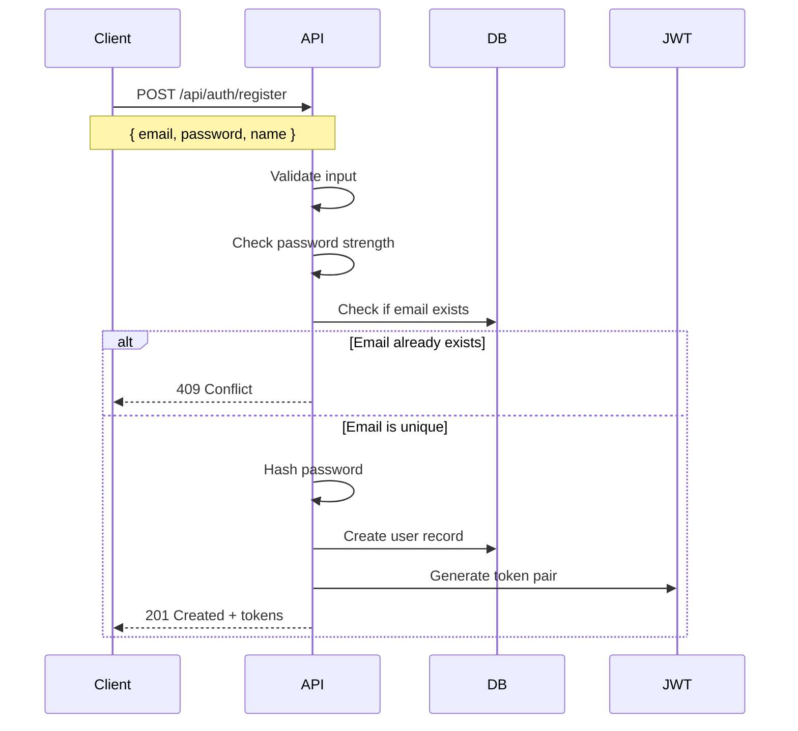
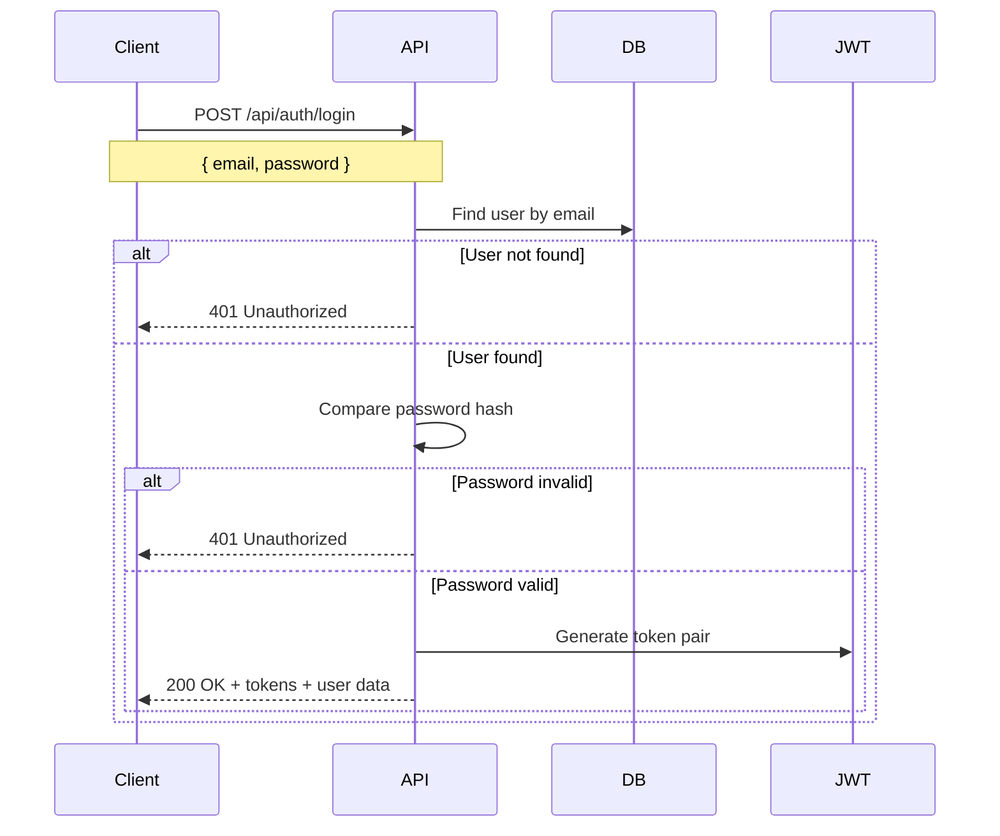
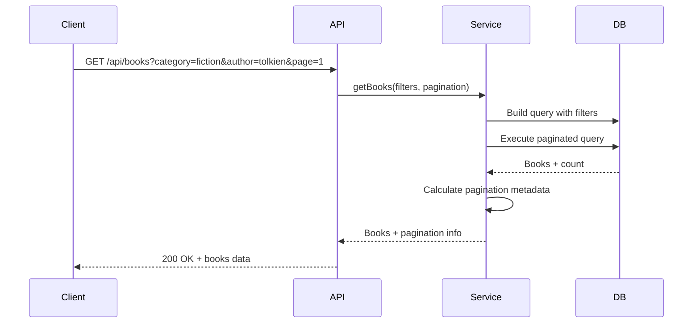
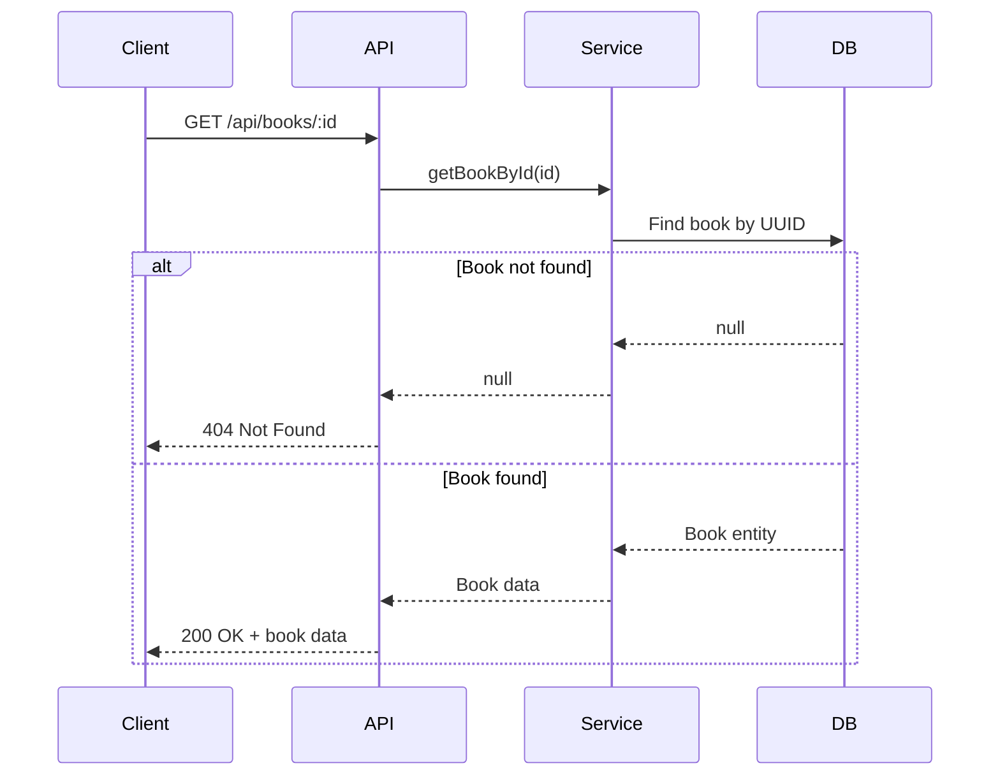
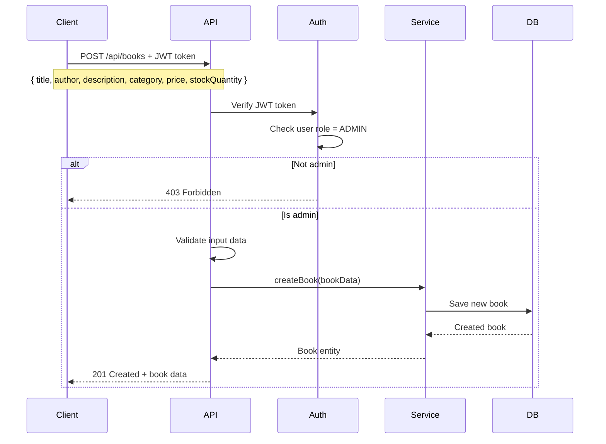
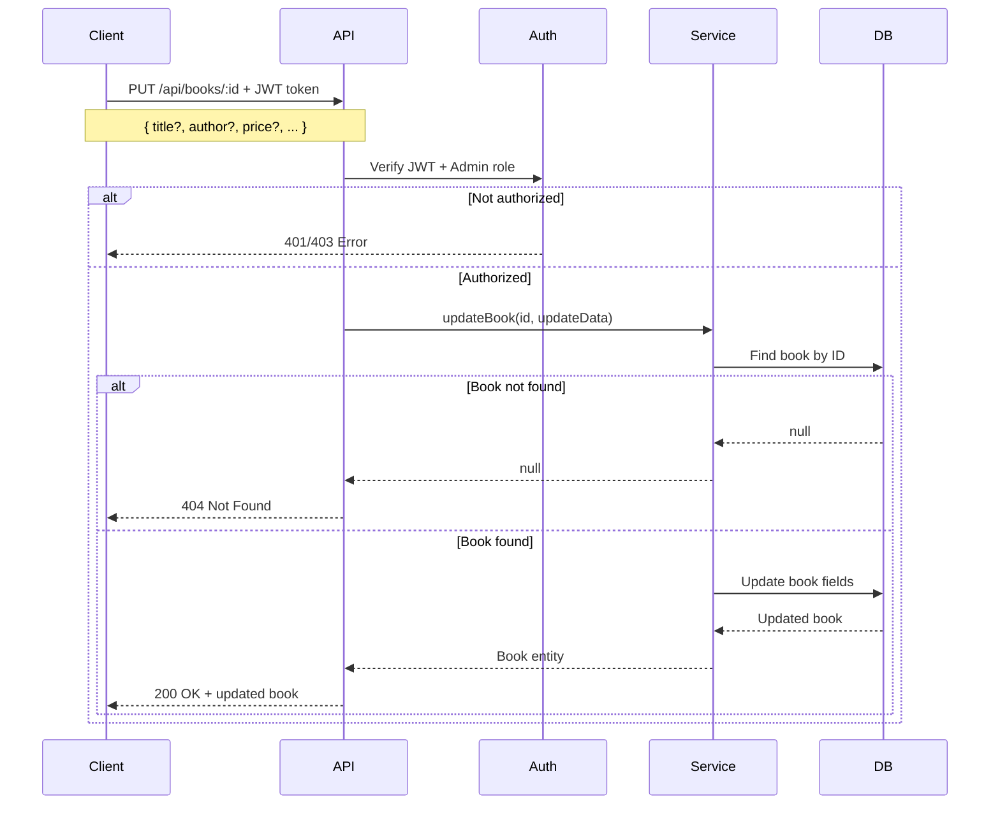
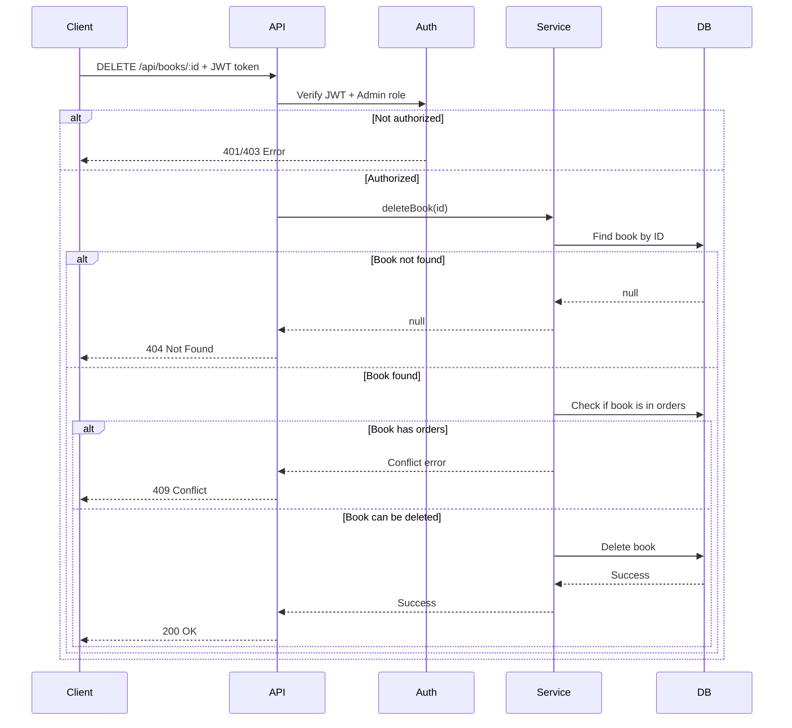

# Bookstore API 📚

A comprehensive REST API for managing a bookstore with user authentication, book management, and order processing. Built with Node.js, TypeScript, Express, PostgreSQL, and TypeORM. Features comprehensive testing with Jest, Docker containerization, and testcontainers for reliable integration testing.

## 📑 Table of Contents

- [🏗️ Architecture Overview](#️-architecture-overview)
- [🚀 Quick Start](#-quick-start)
  - [Prerequisites](#prerequisites)
  - [Method 1: Development Setup (Recommended)](#method-1-development-setup-recommended)
  - [Method 2: Full Docker Setup](#method-2-full-docker-setup)
- [📡 API Endpoints](#-api-endpoints)
  - [Authentication](#authentication)
  - [Books (Public)](#books-public)
  - [Books (Admin Only)](#books-admin-only)
  - [Orders (Authenticated)](#orders-authenticated)
  - [Swagger UI](#swagger-ui)
  - [API Overview](#api-overview)
- [🔐 Authentication Flow](#-authentication-flow)
  - [Registration Flow](#registration-flow)
  - [Login Flow](#login-flow)
- [📚 Book Management Flows](#-book-management-flows)
  - [Get Books with Filters](#get-books-with-filters)
  - [Get Book by ID](#get-book-by-id)
  - [Create Book (Admin Only)](#create-book-admin-only)
  - [Update Book (Admin Only)](#update-book-admin-only)
  - [Delete Book (Admin Only)](#delete-book-admin-only)
- [🧪 Testing](#-testing)
  - [Run All Tests](#run-all-tests)
  - [Test Structure](#test-structure)
- [📊 Code Quality with SonarQube](#-code-quality-with-sonarqube)
  - [Setup SonarQube](#setup-sonarqube)
  - [Access SonarQube](#access-sonarqube)
- [🚀 Future Improvements](#-future-improvements)
  - [🔧 Technical Enhancements](#-technical-enhancements)
  - [🔐 Security & Compliance](#-security--compliance)
  - [📊 Monitoring & DevOps](#-monitoring--devops)

---

## 🏗️ Architecture Overview

The application follows a layered architecture pattern:

```
├── src/
│   ├── config/           # Configuration files (database, swagger)
│   ├── controllers/      # Request handlers and business logic
│   ├── database/         # Database connection, migrations, seeds
│   ├── entities/         # TypeORM entity definitions
│   ├── enums/           # Application enums (roles, categories, status)
│   ├── middleware/       # Express middleware (auth)
│   ├── routes/          # Route definitions
│   ├── services/        # Business logic and data access
│   ├── utils/           # Utility functions (JWT, password)
│   └── validation/      # Input validation schemas
├── tests/               # Test files (unit, integration)
├── docker/              # Docker configuration
└── scripts/             # Setup and utility scripts
```

## 🚀 Quick Start

### Prerequisites

- Node.js (≥18.0.0)
- npm (≥8.0.0)
- Docker and Docker Compose
- Git

### Method 1: Development Setup (Recommended)

```bash
# 1. Clone repository
git clone https://github.com/hhgiap241/99techteam-backend-challenge.git
cd 99techteam-backend-challenge/src/problem5

# 2. Install dependencies
npm install

# 3. Setup environment
cp .env.example .env
# Edit .env with your configuration

# 4. Start database
npm run docker:dev:up

# 5. Setup database
npm run migration:run
npm run seed

# 6. Start application
npm run dev
```

### Method 2: Full Docker Setup

```bash
# 1. Clone repository
git clone https://github.com/hhgiap241/99techteam-backend-challenge.git
cd 99techteam-backend-challenge/src/problem5

# 2. Setup environment for production
cp .env.example .env
# Edit .env with production values (DB_HOST=database,...)

# 3. Start full stack
npm run docker:prod:up
```

The API will be available at `http://localhost:3000`

## 📡 API Endpoints

### Authentication

- `POST /api/auth/register` - Register new user
- `POST /api/auth/login` - User login
- `POST /api/auth/refresh` - Refresh access token
- `GET /api/auth/profile` - Get current user profile

### Books (Public)

- `GET /api/books` - List books with filters and pagination
- `GET /api/books/:id` - Get book by ID

### Books (Admin Only)

- `POST /api/books` - Create new book
- `PUT /api/books/:id` - Update book
- `DELETE /api/books/:id` - Delete book

### Orders (Authenticated)

- `POST /api/orders` - Place new order
- `GET /api/orders` - Get user orders
- `GET /api/orders/:id` - Get order by ID

### Swagger UI

- **URL**: `http://localhost:3000/api-docs`
- **JSON**: `http://localhost:3000/api-docs.json`

### API Overview

- **Base URL**: `http://localhost:3000/api`
- **Health Check**: `http://localhost:3000/health`

## 🔐 Authentication Flow

### Registration Flow



### Login Flow



## 📚 Book Management Flows

### Get Books with Filters



### Get Book by ID



### Create Book (Admin Only)



### Update Book (Admin Only)



### Delete Book (Admin Only)



## 🧪 Testing

### Run All Tests

```bash
# Run all tests
npm test

# Run tests in watch mode
npm run test:watch

# Run tests with coverage
npm run test:coverage
```

### Test Structure

```
tests/
├── unit/                 # Unit tests
│   ├── controllers/     # Controller tests
│   ├── middleware/      # Middleware tests
│   ├── utils/      # Utility tests
│   └── validation/          # Validation tests
├── integration/         # Integration tests
│   ├── routes/         # API endpoint tests
│   └── services/       # Service integration tests
└── utils/              # Test utilities and helpers
```

## 📊 Code Quality with SonarQube

### Setup SonarQube

```bash
# Setup SonarQube project (first time only)
npm run sonar:setup

# Run analysis (tests + coverage + scan)
npm run sonar:analyze
```

### Access SonarQube

- **URL**: `http://localhost:9000`
- **Credentials**: admin/admin (change on first login)
- **Project Key**: `bookstore-api`

## 🚀 Future Improvements

### 🔧 Technical Enhancements

#### API & Architecture

- **Message Queues** - Implement Redis/RabbitMQ for async processing

#### Database & Performance

- **Full-text Search** - Elasticsearch integration for advanced book search
- **Query Optimization** - Advanced indexing and query performance tuning

#### Caching & Storage

- **Redis Caching** - Distributed caching for session management and data
- **File Storage** - S3/MinIO integration for book covers and documents

### 🔐 Security & Compliance

#### Authentication & Authorization

- **OAuth 2.0/OpenID Connect** - Social login integration (Google, Facebook, GitHub)

### 📊 Monitoring & DevOps

#### Observability

- **Metrics Collection** - Prometheus/Grafana monitoring stack
- **Log Aggregation** - ELK stack (Elasticsearch, Logstash, Kibana)
- **Application Performance Monitoring (APM)** - New Relic/Datadog integration

#### DevOps & Deployment

- **CI/CD Pipeline** - GitHub Actions automated deployments

#### E-commerce Features

- **Payment Integration** - Stripe/PayPal payment processing
- **Inventory Management** - Stock tracking and low-stock alerts
- **Shipping Integration** - Real-time shipping costs and tracking
- **Discount & Coupon System** - Promotional codes and bulk discounts

---

**Happy coding! 🚀**
