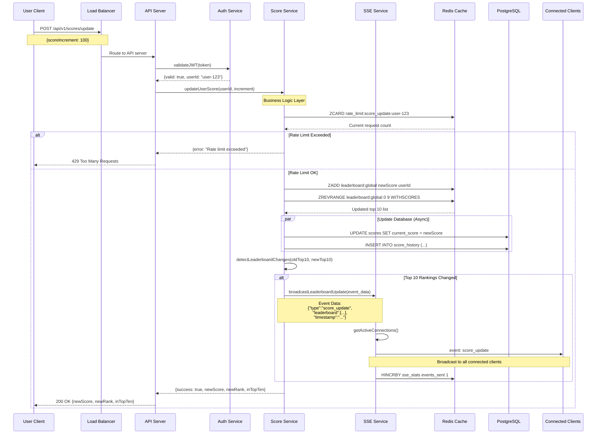

# Real-time Leaderboard API Module 🏆

## Overview

This document specifies a software module for implementing a real-time leaderboard system that displays the top 10 users' scores with live updates. The system prevents malicious score manipulation while providing efficient real-time updates to all connected clients.

---

## 1. Functional Requirements

### 1.1 Core Requirements

- **Real-time Leaderboard Display**: Show top 10 users with their scores, updated in real-time
- **Score Update API**: Authenticated endpoint to increment user scores when actions are completed
- **Live Updates**: All connected clients receive leaderboard updates without page refresh
- **User Authentication**: Secure user identification for score updates
- **Anti-cheat Protection**: Prevent unauthorized score manipulation

### 1.2 Out of Scope

The following features are **NOT** included in this initial implementation:

- ❌ **Action Implementation**: The actual user actions that generate scores (game logic, tasks, etc.)
- ❌ **User Registration/Management**: User creation, profile management, password reset

---

## 2. Non-Functional Requirements

- **API Response**: < 100ms (score updates), < 50ms (leaderboard reads)
- **Real-time Latency**: < 500ms end-to-end
- **Rate Limiting**: 10 score updates per user per minute
- **Anti-Cheat**: Input validation, anomaly detection

---

## 3. API Endpoints

### 3.1 Get Leaderboard API

**`GET /api/v1/leaderboard`**

```json
{
  "success": true,
  "data": {
    "leaderboard": [
      {
        "rank": 1,
        "userId": "user_456",
        "username": "PlayerOne",
        "score": 5000
      },
      {
        "rank": 2,
        "userId": "user_789",
        "username": "GameMaster",
        "score": 4500
      }
    ]
  }
}
```

### 3.2 Score Update API

**`POST /api/v1/scores/update`**

```http
Authorization: Bearer <jwt_token>
Content-Type: application/json

{
  "scoreIncrement": 100,
  "actionType": "quest_completed"
}
```

**Response**:

```json
{
  "success": true,
  "data": {
    "newScore": 1600,
    "newRank": 7,
    "inTopTen": true
  }
}
```

**Error Codes**: `401 Unauthorized`, `429 Rate Limited`, `400 Bad Request`

### 3.3 Server-Sent Events (SSE) - Real-time Updates

#### SSE Connection

**`GET /api/v1/leaderboard/stream`**

```http
Accept: text/event-stream
Authorization: Bearer <jwt_token>
```

#### SSE Event Types

**Leaderboard Update**:

```
event: leaderboard_update
data: {
  "type": "leaderboard_update",
  "leaderboard": [...],
  "timestamp": "2025-08-17T10:30:00.000Z"
}
```

**Heartbeat**:

```
event: heartbeat
data: {
  "type": "heartbeat",
  "timestamp": "2025-08-17T10:30:30.000Z",
  "connectedClients": 847
}
```

### 3.3 Database Models & Schema

#### PostgreSQL Schema

**Scores Table** (Current User Scores):

```sql
-- Enable UUID extension (run once)
CREATE EXTENSION IF NOT EXISTS "uuid-ossp";

CREATE TABLE scores (
    id UUID PRIMARY KEY DEFAULT uuid_generate_v4(),
    user_id UUID UNIQUE NOT NULL,
    username VARCHAR(50) UNIQUE NOT NULL,
    current_score INTEGER DEFAULT 0,
    last_updated TIMESTAMP DEFAULT NOW(),
    created_at TIMESTAMP DEFAULT NOW()
);

CREATE INDEX idx_scores_username ON scores(username);
CREATE INDEX idx_scores_user_id ON scores(user_id);
```

**Score History Table** (Audit Trail):

```sql
CREATE TABLE score_history (
    id UUID PRIMARY KEY DEFAULT uuid_generate_v4(),
    user_id UUID NOT NULL,
    score_change INTEGER NOT NULL,
    previous_score INTEGER NOT NULL,
    new_score INTEGER NOT NULL,
    action_type VARCHAR(50),
    timestamp TIMESTAMP DEFAULT NOW(),

    FOREIGN KEY (user_id) REFERENCES scores(user_id) ON DELETE CASCADE
);

CREATE INDEX idx_score_history_user_id ON score_history(user_id);
CREATE INDEX idx_score_history_timestamp ON score_history(timestamp DESC);
```

#### Redis Data Models

**Leaderboard Sorted Set**:

```redis
# Key: leaderboard:global
# Structure: SORTED SET (score -> user_id)
ZADD leaderboard:global 5000 "user-uuid-1"
ZADD leaderboard:global 4500 "user-uuid-2"

# Operations:
ZREVRANGE leaderboard:global 0 9 WITHSCORES  # Top 10 with scores
ZREVRANK leaderboard:global "user-uuid-1"    # Get user rank
ZSCORE leaderboard:global "user-uuid-1"      # Get user score
```

**SSE Connection Tracking**:

```redis
# Active connections
SET sse:active:{client_id} "{user_id}" EX 300  # 5min TTL

# Connection stats
HSET sse:stats total_connections 1247 events_sent 58392

# User session tracking
SET user:session:{user_id} "{client_id}" EX 86400  # 24h TTL
```

**Rate Limiting Windows**:

```redis
# Sliding window for score updates
ZADD rate_limit:score_update:{user_id} {timestamp} {request_id}
ZREMRANGEBYSCORE rate_limit:score_update:{user_id} 0 {timestamp-60}
ZCARD rate_limit:score_update:{user_id}  # Count requests in window
```

---

## 4. High Level Design

### 4.1 System Architecture


### Technology Stack

**Backend Framework**:

- **Node.js + Express.js**: Fast, lightweight API server with Rate limiting middleware
- **TypeScript**: Type safety and better developer experience
- **JWT**: Stateless authentication

**Data Storage**:

- **Redis**: Primary leaderboard storage (fast operations)
  - Sorted Sets for rankings
  - Hash tables for user data and connection tracking
- **PostgreSQL**: Persistent storage and backup
  - User data and score history
  - Analytics and reporting

---

## 5. Execution Flow

### 5.1 Score Update Broadcast Flow



````

### 5.2 Anti-Cheat Validation Flow

```mermaid
flowchart TD
    A[Score Update Request] --> B[Load Balancer]
    B --> C[API Server]

    C --> D[Auth Service:<br/>Validate JWT Token]
    D -->|Invalid| E[Return 401 Unauthorized]
    D -->|Valid| F[Extract User ID from Token]

    F --> G[Score Service:<br/>Rate Limit Check]
    G -->|Check Redis| H{ZCARD rate_limit:userId}
    H -->|Exceeded| I[Return 429 Rate Limited]
    H -->|OK| J[Score Service:<br/>Validate Score Increment]

    J -->|Invalid| K[Return 400 Bad Request]
    J -->|Valid| L[Score Service:<br/>Anomaly Detection]

    L -->|Suspicious Pattern| M[Log Anomaly Event<br/>+ Flag for Review]
    L -->|Normal Pattern| N[Proceed with Update]
    M --> O{Allow or Block?<br/>Based on severity}
    O -->|Block| P[Return 403 Suspicious Activity]
    O -->|Allow with Warning| N

    N --> Q[Score Service:<br/>Update Redis Leaderboard]
    Q --> R[Score Service:<br/>Update PostgreSQL]
    R --> S{Top 10 Rankings Changed?}

    S -->|Yes| T[SSE Service:<br/>Broadcast Update]
    T --> U[Return Success Response]
    S -->|No| U

    U --> V[API Server Response<br/>newScore, newRank]

````

**Anti-Cheat Rules:**

- **Rate Limiting**: Max 10 score updates per user per minute
- **Score Validation**: Only positive increments ≤ 1000 points per request
- **Anomaly Detection**: Flag users with >5000 points gained in 10 minutes
- **Pattern Analysis**: Detect regular intervals suggesting automation

### 5.3 Connection Establishment Flow

```mermaid
sequenceDiagram
    participant Client as Web Client
    participant LB as Load Balancer
    participant API as API Server
    participant Auth as Auth Service
    participant SSE as SSE Service
    participant Redis as Redis Cache

    Note over Client,API: Initial SSE Connection Setup

    Client->>LB: GET /api/v1/leaderboard/stream
    Note over Client,LB: Headers:<br/>Accept: text/event-stream<br/>Cache-Control: no-cache<br/>Authorization: Bearer [token]

    LB->>API: Route to API server
    API->>Auth: validateToken(token)

    alt Valid Token
        Auth-->>API: userId, valid=true
        API->>SSE: createConnection(clientId, userId)
        SSE->>Redis: SADD sse_clients:active clientId
        SSE->>Redis: SETEX sse_client:clientId 300 metadata

        SSE-->>API: connection_id
        API->>Client: HTTP 200 OK
        Note over API,Client: Headers:<br/>Content-Type: text/event-stream<br/>Connection: keep-alive<br/>X-Accel-Buffering: no

        SSE->>Redis: ZREVRANGE leaderboard:global 0 9 WITHSCORES
        Redis-->>SSE: Current top 10 data

        SSE->>Client: event: leaderboard_full
        Note over SSE,Client: data: {"type":"leaderboard_full",<br/>"leaderboard":[...],<br/>"timestamp":"2025-08-17T10:30:00Z"}

        loop Every 30 seconds
            SSE->>Client: event: heartbeat
            Note over SSE,Client: data: {"type":"heartbeat",<br/>"timestamp":"...",<br/>"connectedClients":847}

            alt Client not responding
                SSE->>Redis: SREM sse_clients:active clientId
                SSE->>Redis: DEL sse_client:clientId
            end
        end

    else Invalid Token
        Auth-->>API: valid=false
        API->>Client: HTTP 401 Unauthorized
    end

    Note over Client,Redis: Connection stays active for real-time updates
```

---

## 6. Future Improvements

### 6.1 Scalability Enhancements

- **Redis Clustering**: Distribute leaderboard data across multiple Redis nodes with consistent hashing
- **Database Sharding**: Partition user data by user_id ranges or geographic regions
- **API Server Auto-scaling**: Kubernetes HPA based on CPU/memory usage and SSE connection count
- **Multi-region Deployment**: Deploy in multiple AWS/Azure regions with cross-region replication

### 6.2 Performance Enhancements

- **CDN Integration**: Cache static leaderboard snapshots at edge locations for global users
- **Connection Pooling**: Implement Redis and PostgreSQL connection pooling (PgBouncer, Redis connection pools)
- **Batch Processing**: Group multiple score updates for efficient database writes
- **Read Replicas**: PostgreSQL read replicas for analytics and backup queries
- **Caching Layers**: Multi-tier caching (L1: In-memory, L2: Redis, L3: Database)

### 6.3 Advanced Features

- **Multiple Leaderboards**: Category-based (daily, weekly, monthly), regional, skill-level leaderboards
- **Historical Rankings**: Track rank changes over time with trend analysis
- **WebSocket Upgrade**: Bidirectional communication for interactive features
- **Push Notifications**: Mobile push notifications for rank changes and achievements
- **Achievement System**: Real-time achievement unlocks with visual celebrations
- **Live Events**: Special tournament modes with real-time brackets and updates

### 6.4 Security & Anti-Cheat

#### Advanced Anti-Cheat Systems

- **Machine Learning Detection**: ML models to detect unusual scoring patterns and bot behavior
- **Device Fingerprinting**: Prevent multiple accounts from same device using browser/mobile fingerprints
- **Action Verification**: Cryptographic proof-of-work for high-value score increments
- **Behavioral Analysis**: Time-series analysis of user actions to detect automation
- **Honeypot Traps**: Invisible actions to catch automated cheating systems

#### Security Hardening

- **Rate Limiting per Action**: Different limits for different game actions and user tiers
- **DDoS Protection**: Advanced traffic filtering with Cloudflare/AWS Shield
- **Audit Logging**: Comprehensive activity logging with SIEM integration
- **Encrypted Communications**: End-to-end encryption for sensitive score operations
- **API Security**: OAuth 2.0, API versioning, input sanitization, SQL injection prevention

### 6.5 Analytics & Business Intelligence

#### Advanced Analytics

- **User Behavior Tracking**: Score gain patterns, peak activity times, engagement metrics
- **Leaderboard Analytics**: Competitive analysis, retention correlation, churn prediction
- **Performance Monitoring**: Detailed latency metrics, error rates, system health dashboards
- **Predictive Analytics**: Forecast user engagement, score trends, and system load

#### Monitoring & Observability

- **Distributed Tracing**: End-to-end request tracing across microservices (Jaeger/Zipkin)
- **Custom Metrics**: Business KPIs (scores per minute, rank volatility, user engagement)
- **Intelligent Alerting**: ML-based anomaly detection for system and business metrics
- **Log Aggregation**: Centralized logging with ELK stack and searchable dashboards

### 6.6 Operational Excellence

#### DevOps & Deployment

- **Blue-Green Deployment**: Zero-downtime deployments with instant rollback capability
- **Infrastructure as Code**: Terraform for reproducible deployments
- **CI/CD Pipelines**: Automated testing, security scans, and deployment pipelines with GitHub Actions

#### Business Integration

- **A/B Testing**: Test different scoring mechanisms and UI variations
- **Revenue Integration**: Monetize leaderboard features with premium tiers and cosmetics
- **Social Media Integration**: Share achievements on Twitter, Facebook, Discord
- **Third-party APIs**: Integration with game platforms, analytics tools, customer support

---
