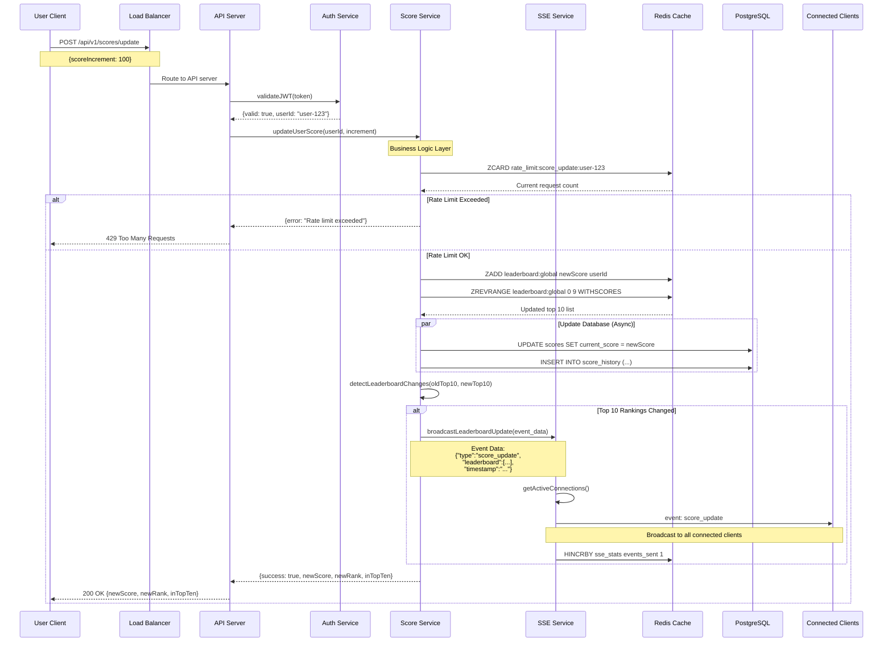
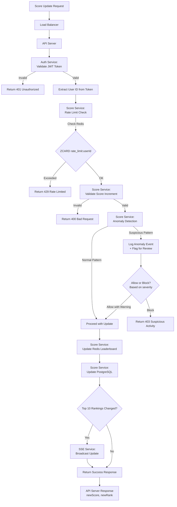
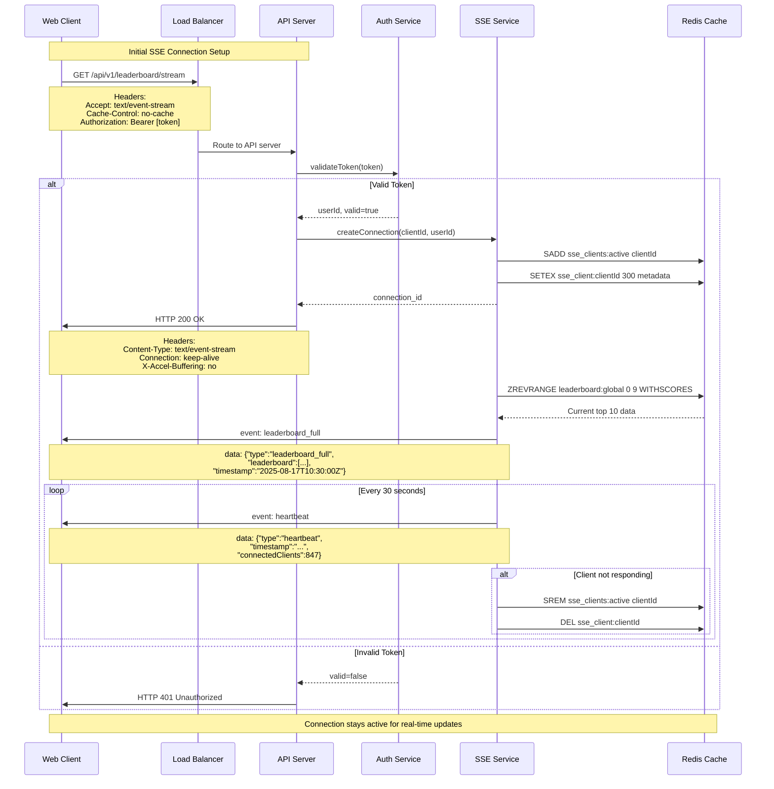

### 5.1 Score Update Broadcast Flow

### 5.2 Anti-Cheat Validation Flow

**Anti-Cheat Rules:**

- **Rate Limiting**: Max 10 score updates per user per minute
- **Score Validation**: Only positive increments ≤ 1000 points per request
- **Anomaly Detection**: Flag users with >5000 points gained in 10 minutes
- **Pattern Analysis**: Detect regular intervals suggesting automation

### 5.3 SSE Connection Establishment Flow

